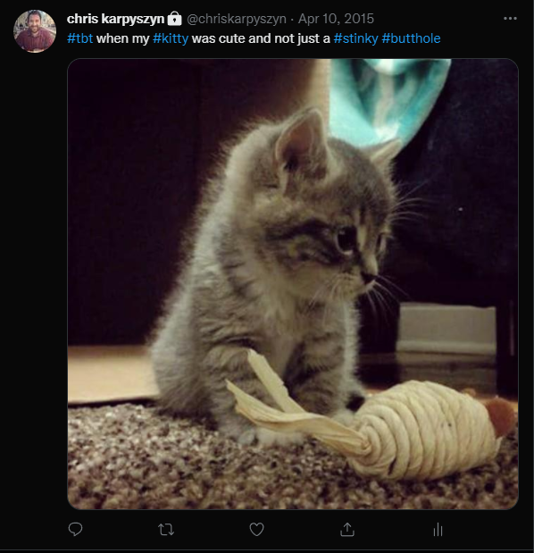
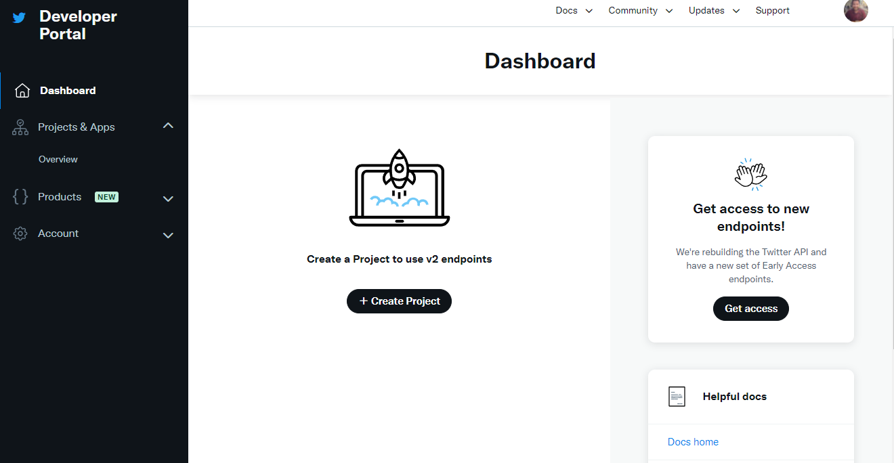
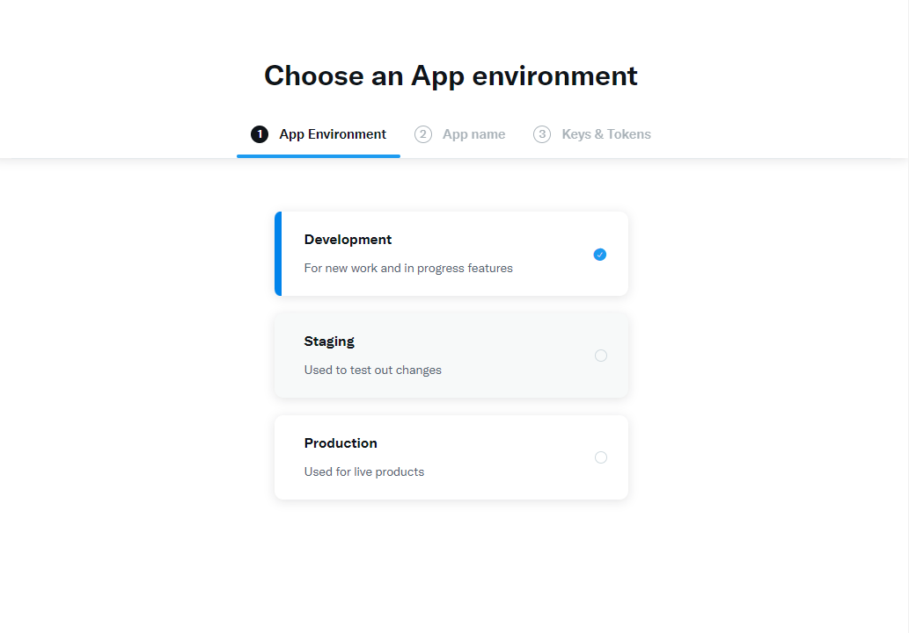
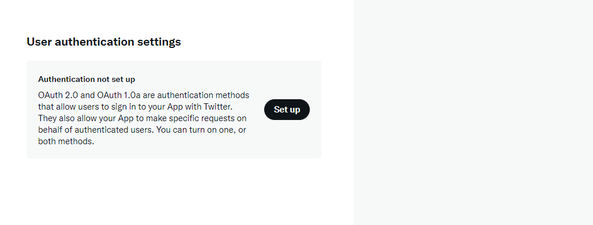
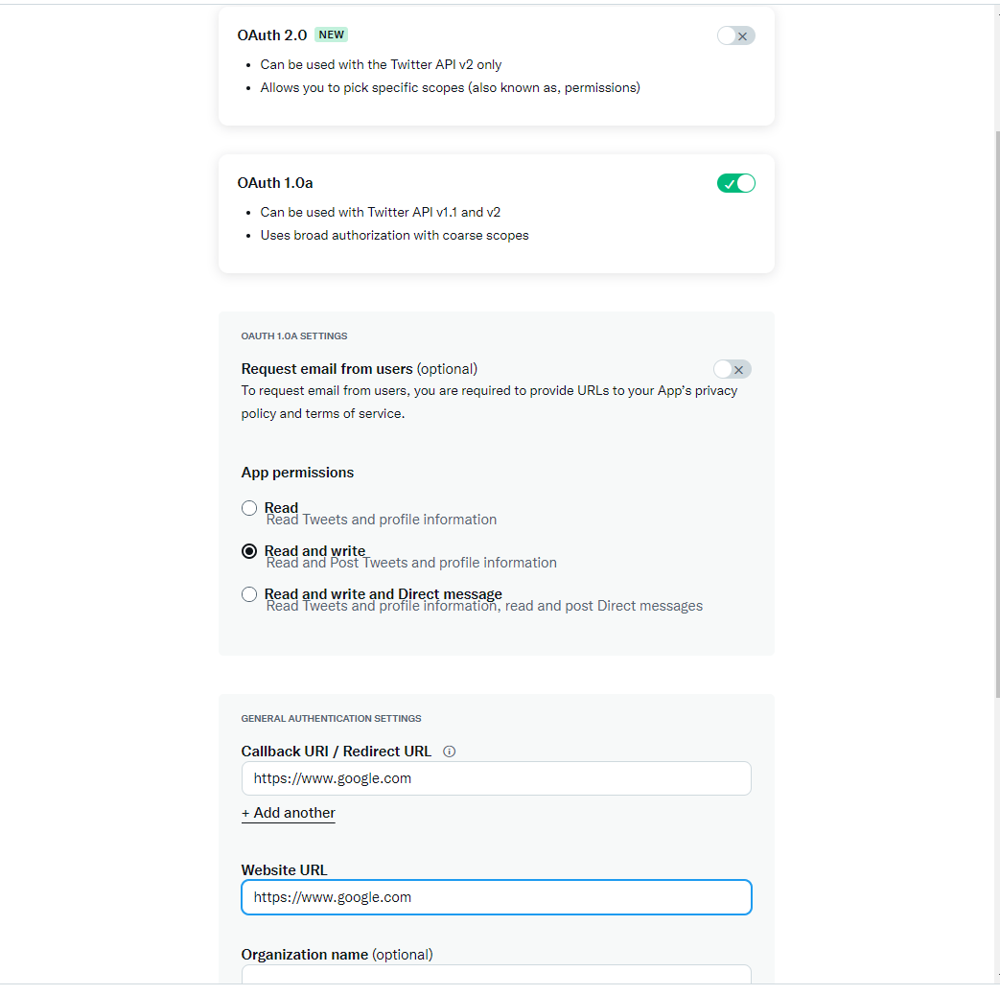
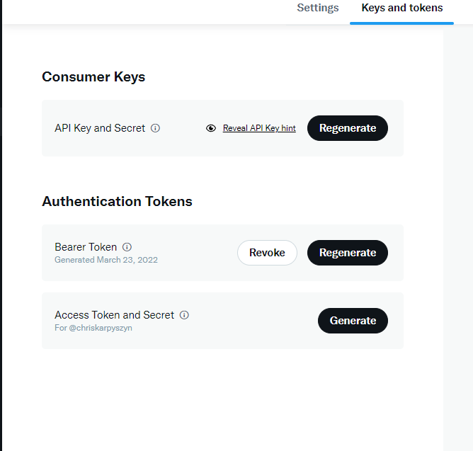
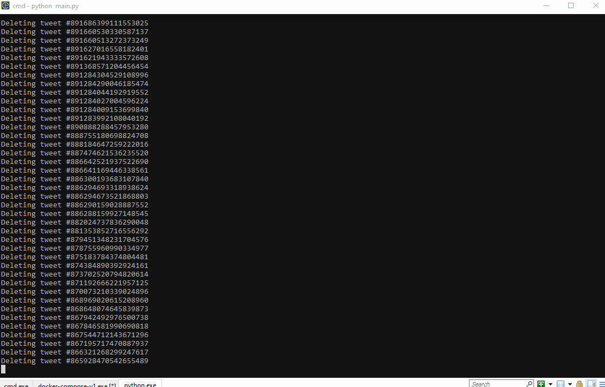

# RAZE TWEETS


There is no good reason to keep over ten-year-old tweets in the public domain. [There really isn't](https://www.theverge.com/2018/7/20/17596452/guardians-of-the-galaxy-marvel-james-gunn-fired-pedophile-tweets-mike-cernovich). Regardless of what you may have said in the past, thousands of tweets is just irrelevant noise.



Take control of your data. Raze your tweets!

> **WARNING:** Running this with API keys with write access **WILL** delete all of your tweets. \
> **_DO NOT RUN CODE YOU DO NOT UNDERSTAND_**

## Create a backup
Use [this link](https://twitter.com/settings/your_twitter_data) to log into your account and request your archive. You do not need to do this step to delete your tweets. It can take up to 24 hours for Twitter to email you a link to download your archive.

## Create API keys to access your account

Sign in to the [Twitter Developer Portal Dashboard](https://developer.twitter.com/en/portal/dashboard) and create a project by filling out all the required information.

 

When choosing an environment, select Development. Give your app a unique name and copy your API Key and API Key Secret.

 

Next, set up authentication settings, so your keys grant you write access.

 

OAuth 1.0a will work here with read and write permissions. You can simply enter any URL for the required callback and website URL, and you will not be using these URLs in your app.

 

Lastly, generate your Access Token and Secret from the Keys and Tokens tab.

 

## Add keys and run code
Remove `_sample` from `.env_sample` and add your api keys to the file 
```dotenv
CONSUMER_KEY=
CONSUMER_SECRET=
ACCESS_TOKEN_KEY=
ACCESS_TOKEN_SECRET=
```

Run code using python 
```
python main.py
```


## Invalidate your keys!
Trust me here. You won't need to rerun this script on purpose again. But, accidentally wiping your data when testing something or showing a friend how this script works? Yeah, that will happen if you leave your API keys set up in your environment variables.

Take the time to delete your app and project from your account and avoid accidents or getting hacked.


## Notes
When running this with 3000+ tweets, I noticed that after about 2000 deleted tweets, I stopped receiving statuses from the API, and Twitter stopped showing them on my page. The app finished gracefully. If this happens, just rerun. This might be a limitation to the API. 